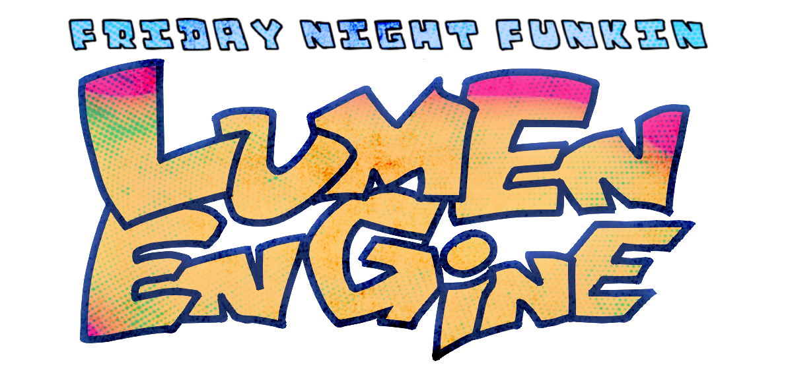

    

a fork of p-slice (v2.3.1) built to be **modular**, **scriptable outside of songs**, and fully **psych-compatible** without all the hardcoding.

not trying to reinvent the wheel – just making it easier to bolt on new ones. basically a fork of a fork of a fork. why the fuck did i do this.

---

## features
- script menus + states outside songs (titlescreen, freeplay, etc.) (thanks emi)
- custom intro splash screen  
- modern psych chart + engine feature support  
- based on p-slice: freeplay characters, new base game systems  
- new "epic" rating (thanks duskiewhy and unholywanderer)  
- base fnf content is now a separate modpack  

(still a wip, more stuff coming)

---

## base fnf content
the vanilla fnf assets + songs are hosted as a separate modpack here:  
➡️ [fnf lumen port](https://github.com/ledonic852/FNF-LumenPort)

clone/download it into your mods folder if you want the base game.

---

## compiling
you’ll need:
- **haxe 4.3.7** (or lower, untested on older)  
- **lime + openfl** (latest versions)  
- other libs: see `setup/windows.bat`

build commands:

`haxelib run lime setup` then `lime test cpp`

or alternatively `haxelib run lime test windows`

> windows only right now. linux/mac: try wine or port it.

---

## contributing
- make a new branch for changes  
- keep things modular, avoid hardcoding  
- open a pr with a description of your changes  
- document new scripts/entry points

contact: discord `bobbydx428`  
fork it or use code as needed, just credit me somewhere.

---

## known issues
- no mobile support (not planned)  
- also no hashlink or html5 compiling
- windows only (wine works sometimes for linux and mac idk)

---

## license
apache 2.0. see [here](/LICENSE)

---

## credits
- **bobbydx** – creator of lumen engine  
- **ledonic** – base fnf modpack + content  
- **phoenixpunk** – source tweaks + testing  
- **ashley / emi3 / victoria** – original custom state scripting fork  
- **mikolka9144** – p-slice engine  
- **shadowmario** – psych engine  
- **funkin' crew inc.** – friday night funkin'

---

    

